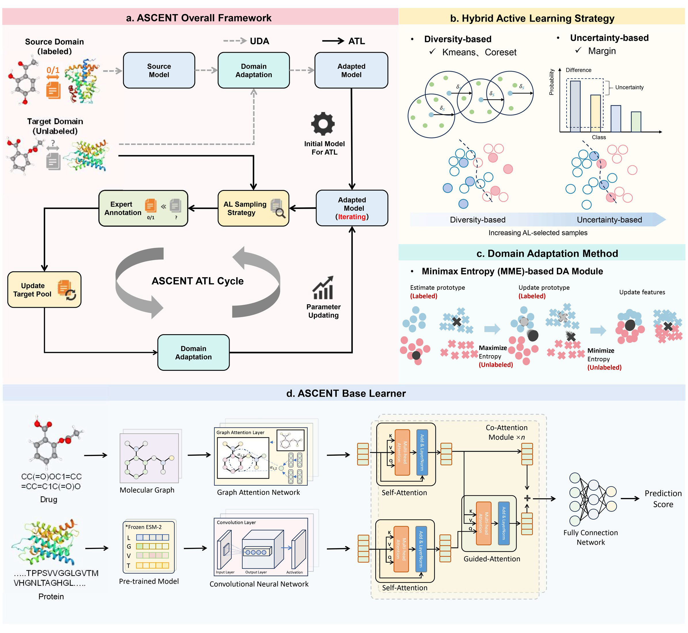

# Official Implementation of ASCENT
This repository contains the official implementation of the paper **"An active transfer learning paradigm for drug-target interaction prediction with ASCENT"**. 



## System Requirements

```
fair-esm               2.0.0
scikit-learn           1.0.2
rdkit                  2023.3.2
numpy                  1.21.6
torch                  1.13.1+cu116
torch-cluster          1.6.1+pt113cu116
torch-geometric        2.3.1
torch-scatter          2.0.9
torch-sparse           0.6.17+pt113cu116
tqdm                   4.67.1
networkx               2.6.3
omegaconf              2.3.0
```

## Data Download
The `data` folder required for this project is too large to host on GitHub. You can download it from Figshare using the following link:

[Download Data from Figshare](https://doi.org/10.6084/m9.figshare.28525688.v1)

After downloading, extract the contents of the archive into the `data` folder in the root directory of this repository.


## Installation Guide

```
$ conda create -n ASCENT python=3.7
$ conda activate ASCENT

# You can find more versions of Torch in this link.(https://pytorch.org/get-started/previous-versions/)
$ pip install torch==1.13.1+cu116 torchvision==0.14.1+cu116 torchaudio==0.13.1 --extra-index-url https://download.pytorch.org/whl/cu116

$ pip install fair-esm
$ pip install scikit-learn
$ pip install rdkit==2023.3.2
$ pip install tqdm
$ pip install omegaconf
$ pip install networkx

# You can find torch_cluster/torch_scatter/torch_sparse in this link(https://pytorch-geometric.com/whl/)
# You can download the installation package corresponding to your torch version from the link for installation, or you can install it using the installation package we provide. Taking the Windows system as an example

$ cd packages
$ pip install torch_cluster-1.6.1+pt113cu116-cp37-cp37m-win_amd64.whl
$ pip install torch_scatter-2.0.9-cp37-cp37m-win_amd64.whl
$ pip install torch_sparse-0.6.17+pt113cu116-cp37-cp37m-win_amd64.whl
$ pip install torch_geometric
```

## Data Preparation

```
# Extract the fasta file : Enter the dataset name in --DATASET 
$ python ESM_extract.py --DATASET='biosnap'

# get protein embedding feature from ESM2
$ python data/esm-main/scripts/extract.py esm2_t6_8M_UR50D data/fasta_data/biosnap/train/data.fasta data/esm_feature/biosnap/train --repr_layers 5 --include per_tok 

$ python data/esm-main/scripts/extract.py esm2_t6_8M_UR50D data/fasta_data/biosnap/val/data.fasta data/esm_feature/biosnap/val --repr_layers 5 --include per_tok 

$ python data/esm-main/scripts/extract.py esm2_t6_8M_UR50D data/fasta_data/biosnap/test/data.fasta data/esm_feature/biosnap/test --repr_layers 5 --include per_tok 

```


## RUN

```
# Train only on in-domain data
$ python main.py --task='None_DA'  --source_dataset_select='biosnap'

# Train on cross-domain data
$ python main.py --task='DA'	--source_dataset_select='biosnap_source' --target_dataset_select='biosnap_target'

# Train on cross-domain data and use active learning
$ python main.py --task='ADA'	--source_dataset_select='biosnap_source' --target_dataset_select='biosnap_target'

--source_dataset_select		type=str, help="source domain data", default="biosnap_source"
--target_dataset_select		type=str, help="target domain data", default="biosnap_target"
--device				type=str, default="cuda:0"
--al_runs				type=str, help="Number of repeated experiments", default="1"
--Suffix				type=str, help="Define your comment content", default=""
--al_strat				type=str, help="Sampling strategy", default="Kmeans+margin"
--task  				type=str, help="None_DA / DA / ADA", default="None_DA"
```

